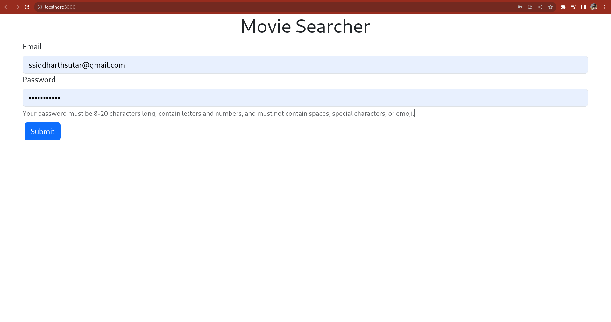
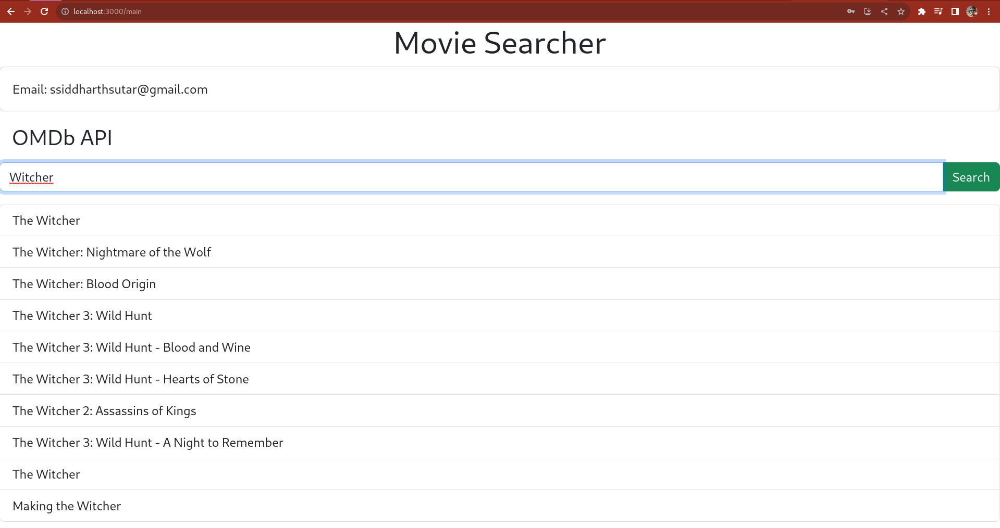

# How to run the APP?

* Change directory to server, run the server first
  * command npm run dev
* Change directory to client, run the client
  * command npm run start

# Look and feel

Search your favorite movies

